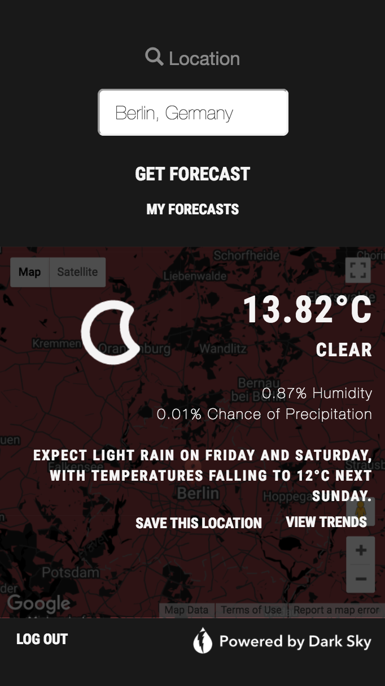

##### Maya Goldstein

##### Bluewolf Salesforce Developer I Assignment

# SkyMap: Real Forecasts in Real Time

### Live Site

Hosted on Heroku:

* Front End: https://skycast-maya.herokuapp.com/
* Back End: http://skycast-api-maya.herokuapp.com/

### Workflow

GitHub:

* Front End: https://github.com/mayagold/SkyCast-FrontEnd
* Back End: https://github.com/mayagold/skycast_app_api

### Summary

This app leverages [Dark Sky API](https://developer.forecast.io) and [Google Maps API](https://developers.google.com/maps), allowing users to retrieve current as well as historic weather data for any location for which Google Maps has the correct latitude and longitude coordinates.

### User Stories: MVP

* Users should be able to enter in any location and retrieve current and useful information about the weather in that area, as well as a future forecast.

  * User enters location into Google Maps Search Box
  * SkyMap finds the latitude and longitude coordinates using Google Maps API data
  * SkyMap inputs the coordinates into a hidden search field
  * User can click "get forecast" triggering SkyMap to make multiple API calls to Dark Sky API, sending the coordinates
  * Dark Sky API returns current, recent, and future weather information for the user's location   
* User should be able to see relevant information to his/her location or searched area (in chart format, using any visualization library) within a reasonable time period.

  * After getting a forecast, user can click "View Trends" and view a Google Chart of temperature and precipitation data for the past two days, the current day, and the next day
* User should be able to track his/her search history (user’s search queries should be stored between browser sessions).
  * User is given the option to register/login or use the app as a guest
  * User can create an account, log in, and save favorite locations to user's own database
  * Upon each subsequent login, user's locations are loaded
  * User can view current data for all locations at once by clicking "My Forecasts"

### Technologies

* Frontend
  * JavaScript (AngularJS)
  * CSS Bootstrap
  * Sass CSS  
  * Google Charts Visualization Tool
* Backend
  * JWT
  * Ruby on Rails
* Hosting Platform: Heroku
* Third Party APIs: Google Maps, Dark Sky

### Design

* Usability
  * Mobile-first styling - users will likely access the app through a mobile device

**Approach:**

* Utilize Bootstrap CSS to enhance the responsiveness of the app and create a familiar, intuitive user experience.

* Utilize symbols and icons to minimize text content and create a clean interface.

* Focus on writing clean, DRY code with appropriate formatting and commenting to allow for easy interpretation by other developers (or myself, when revisiting old code).

### Process

1. Wireframes
1. Trello
1. Step 1: Skeleton content (front and back end)
1. Step 2: Basic CSS formatting of skeleton content
1. User Authentication (JSON Web Tokens)
1. Step 3: Google Maps and Dark Sky API calls
1. Locations model allowing users to store (create) and remove (delete) past searched locations
1. Front end design: optimize the user experience
1. Include JS application frameworks (AngularJS) and resource pre-compilers (Sass) as a stretch goal

### Bugs and Unsolved Problems

* Design
  * There is always a way to improve design. I focused on styling for mobile and there is still a long way to go before this site looks beautiful on the Desktop. However, the basic structure and layout of content on the page reflects my ultimate vision.
  * Google Chart: This was my first time using Google Charts. I found it easy and intuitive to use, but I do not like the way it looks. Room for improvement.
* API Keys
  * Currently, all of my API calls are happening in the front end. In the interest of prototyping I sacrificed security, which is obviously a huge problem that would need to be solved if this app were to be released to the public.
    * Solution: Pass the latitude and longitude coordinate values to the back end SkyMap server, and make the API calls through Rails. Store the API keys in a .env file.

### Resources

Tutorials, documentation, sources, and creative inspiration:

* [Google Developers Documentation: Google Maps Searchbox](https://developers.google.com/maps/documentation/javascript/examples/places-searchbox)
* [Tutorial: Building a Weather App with the Dark Sky API](https://webdesign.tutsplus.com/tutorials/building-a-weather-app-with-the-darksky-api--cms-28678)
* [Dark Sky API Documentation](https://darksky.net/dev/docs)
* [Google Maps APIs Styling Wizard](https://mapstyle.withgoogle.com/)
* [Skycons](https://darkskyapp.github.io/skycons/)
* [Google Charts](https://developers.google.com/chart/)
